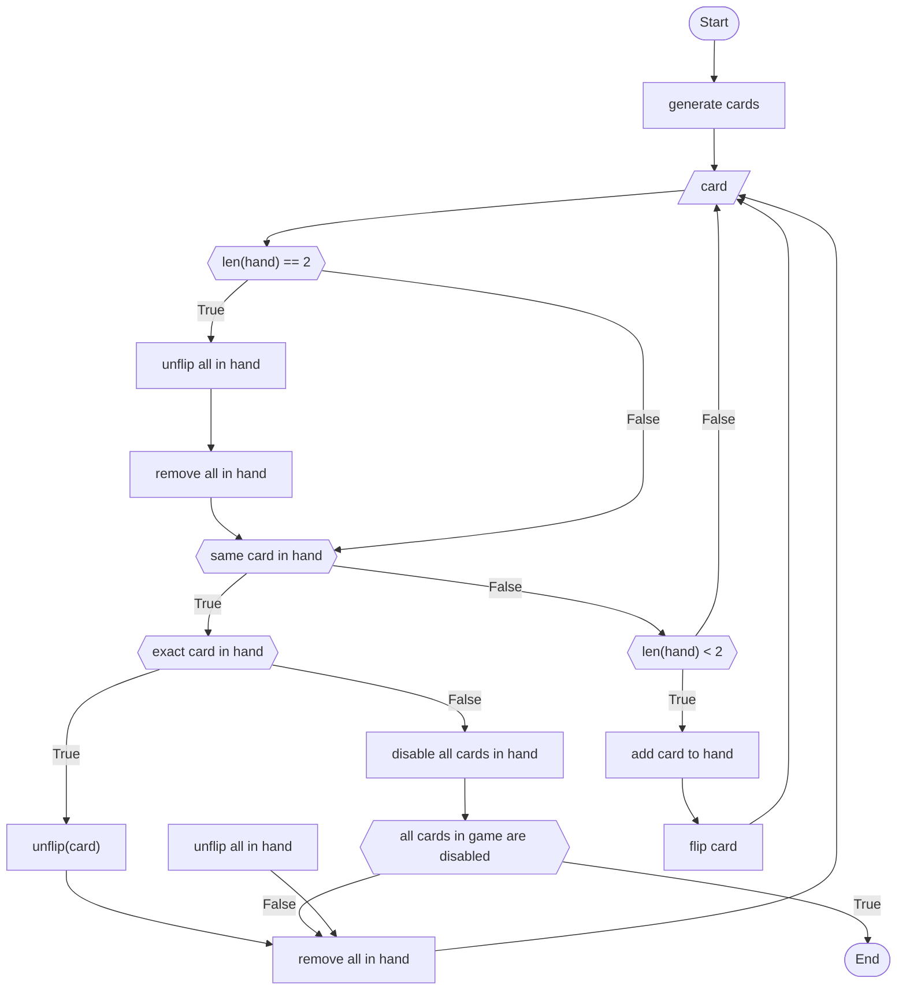

# Game of Memory

A board is full of overturned cards. There is a pair for each card. The player flips over two cards. If they match, then they stay overturned. Otherwise they flip back. The player needs to overturn all the cards in the fewest moves to win.

This is one of my weekend game projects where I try to create a simple game in a single weekend.

## Game flow

# Using

## Setting Up
    git clone git@github.com:jnmbk/wg-memory.git
    cd wg-memory
    pip install -e .

## Running
    python -m game.main

